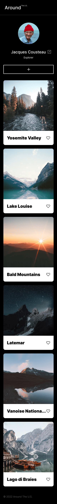

# Project 3: Around The U.S.

### Overview

- Intro
- Figma
- Images

**Intro**

The Around the US webpage is the third project in the Software Engineer program at Practicum. It was created using HTML and CSS, based on a design brief using Figma. This project features:

- Semantic HTML5
- Flexbox
- Positioning
- Media Queries
- Grid Layout
- Adapative Web Design

**Figma**

- [Link to the project on Figma](https://www.figma.com/file/ii4xxsJ0ghevUOcssTlHZv/Sprint-3%3A-Around-the-US?node-id=0%3A1)

**Images**

